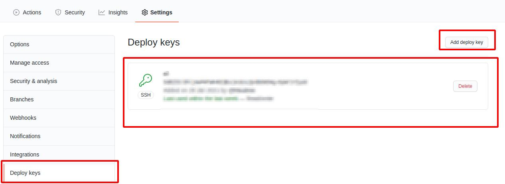
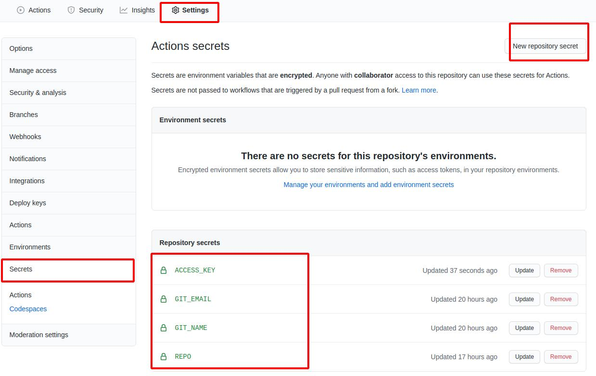
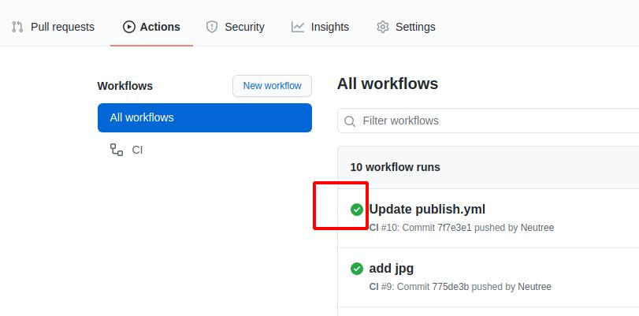
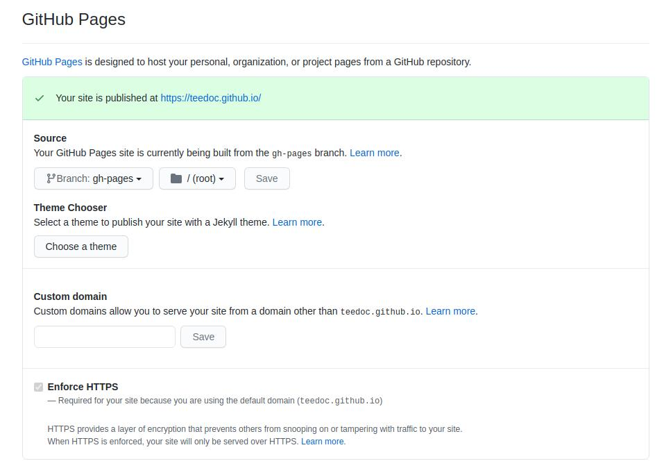

## Clone the template warehouse

Visit [https://github.com/teedoc/teedoc.github.io](https://github.com/teedoc/teedoc.github.io)
Click `Use this template`

Then fill in the new warehouse name (if you won't use custom domain, the warehouse name is preferably `teedoc.github.io` and replace `teedoc` with your user name or organization name) and description. Create a new warehouse of your own based on this warehouse, and now you have it The warehouse is exactly the same as the official website of `teedoc`
> You will find a directory of `.github/workflows`, this is the configuration file of `github action`, we use this function to achieve:
> When we update the source file of the warehouse, `github action` automatically builds and generates static web pages according to the commands of this configuration file, and then pushes to the `gh-pages` branch of this warehouse

## Generate ssh key

Then generate a pair of `key` locally (relevant software needs to be installed under windows, please install it yourself (you will have it if you install git))
```
ssh-keygen -t rsa -f key.txt
```
Got the two files `key.txt` and `key.key.pub`

## Set key

Set the `ssh` key in the settings of the document project, add a `ssh` key, copy the content in `key.txt.pub`, pay attention to the `pub` file, which is the public key, and take whatever name you want


Then click `Secrets` to set secret key-value pairs. The variables that need to be set are:
* `ACCESS_KEY`: Copy the content in `key.txt`
* `GIT_EMAIL`: Set a `git` submission email, just set your `github` email
* `GIT_NAME`: Set a `git` commit name, just set your `github` name
* `REPO`: warehouse address, set to `organization name/warehouse name` or `user name/warehouse name`, such as `teedoc/teedoc.github.io`



## Trigger build

Like a warehouse submitting a modification, the build will be triggered automatically. You can see the progress and logs in the `Actions` column

If it is a green tick, it means a success, otherwise it means a failure. You can click in to see what errors are reported in the build log. Generally, the previous value is filled in wrong



## Set up pages service

Then find the `pages` service setting in the settings, open it, and then visit the corresponding domain name, you can check the `Enforce HTTPS` to enable `HTTPS` (recommended)
For example, here is `https://teedoc.github.io/`

>! Note that if the following path is not `/`, and there is no custom domain name (see the following introduction for custom domain names), such as `https://teedoc.github.io/my_site/`, then it needs to be in `site_config.json` Configure `"site_root_url":"/my_site/"`



## Pages Service Custom Domain

After deployment, there will be a default domain name, such as `teedoc.github.io`. If you want to use your own domain name, such as `teedoc.neucrack.com`, you need to customize the domain name.

The file directory of the website root directory mapping is set in the `site_config.json` file, for example, here is the `pages/index/zh` directory:
```json
        "pages": {
            "/": "pages/index/zh",
            "/en/": "pages/index/en"
        },
```

Create a new file in this directory, name it `CNAME` and note that there is no suffix, then write a custom domain name such as `teedoc.neucrack.com`, save the file, and submit it

> You may see the setting of `custom domain` in the settings, but you need to set the `CNAME` file as mentioned here to keep it in effect, otherwise the custom domain name will be invalid next time you submit it

