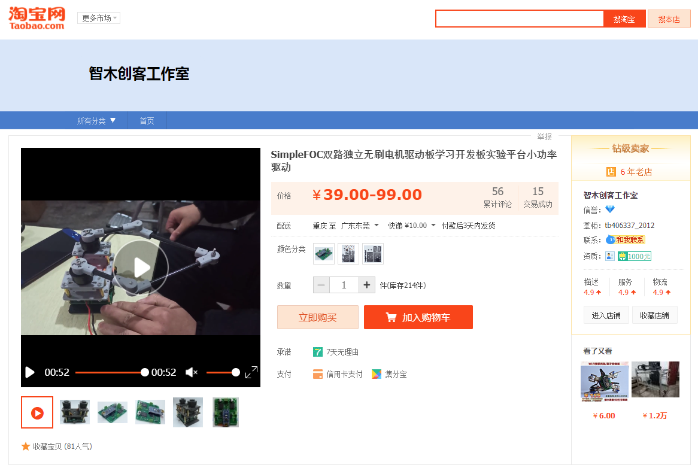
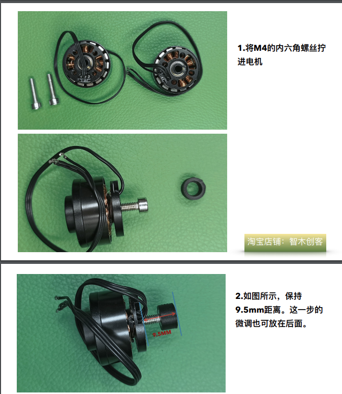
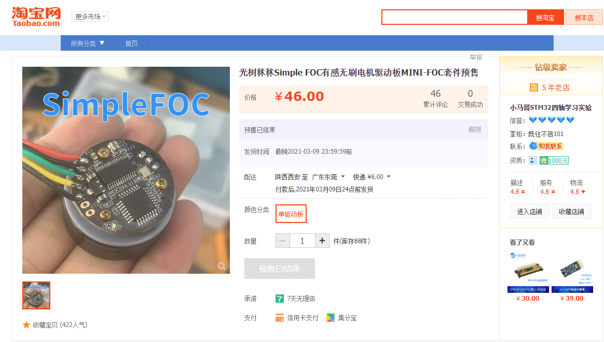
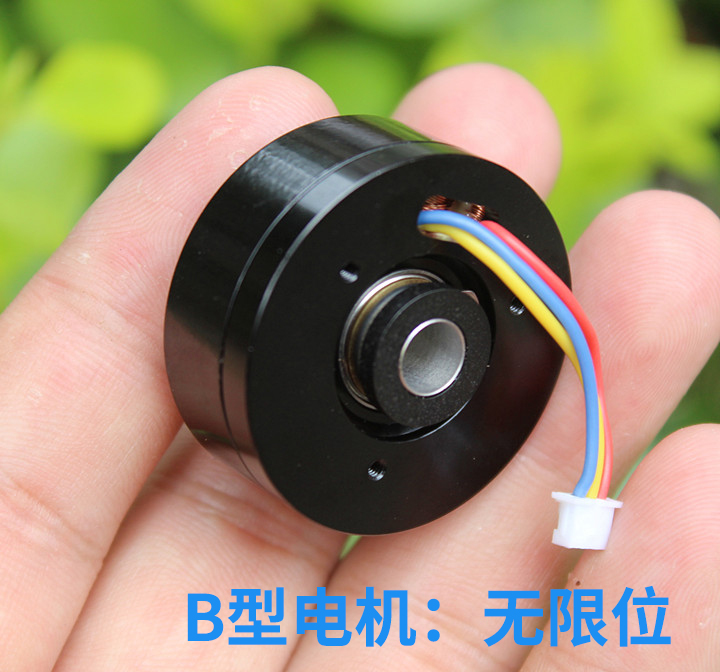

# 电机选型

目前能看到的同类产品有两套
  一个是淘宝店“[智木创客工作室](https://shop111632380.taobao.com/)”推出的
  另一个好像是bilibili一个up主出的，叫[光树秫秫](https://space.bilibili.com/15363421)

## 智木创客工作室的套件

  智木创客工作室推出的淘宝链接是[这个](https://item.taobao.com/item.htm?spm=a1z0d.6639537.1997196601.15.60457484L76MvI&id=633801964714)
  

这家出的有点意思，他用螺丝+打印件+磁铁的方式，进行组装，强行加了一个磁编码器，可以买几个电机稍微研究一下，说不定可以改改
  

至于电机的货源，也找到了，[这里是链接](https://item.taobao.com/item.htm?spm=a1z0d.6639537.1997196601.33.143c7484qFnaTQ&id=594557269837)（立华电子永远的神！）
  

## 光树秫秫出的板子

  下面这个是视频介绍
<iframe src="//player.bilibili.com/player.html?aid=756184913&bvid=BV1Ur4y1T7fG&cid=282927148&page=1" scrolling="no" border="0" frameborder="no" framespacing="0" allowfullscreen="true"> </iframe>

  稍微找了下可以看出，他的电机是这个，成本好像还行，不是很贵（经典背景）
  

  但是淘宝找了一下，好像没有卖的了（可能这就是他们预售没有继续的原因吧），找了个类似的，链接在[这里](https://item.taobao.com/item.htm?spm=a1z0d.6639537.1997196601.4.143c7484qFnaTQ&id=599945379051) 

## 结论
我比较偏向于用第二个，这个有自带的磁环，而上面那个要额外增加一个螺丝+磁铁

# 驱动方案选型

## L6234PD013TR
大概看了下，SimpleFoc和智木创客工作室这两家用的方案都是这个

## drv8313
光树秫秫选用的是这个型号

## drv8316
ti还推荐了这个，封装比较喜欢，不过暂时没货

# 霍尔方案选型

## AS5047
20左右

## AS5048A
25-30元

## AS5600
6.2，就是他了